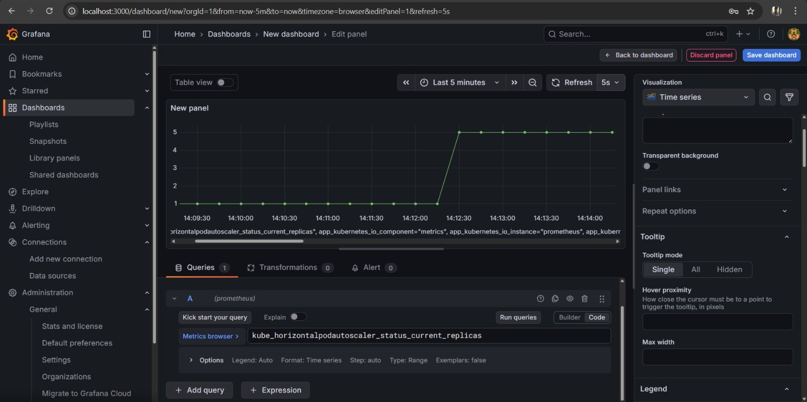

# Kubernetes Log Management System

A microservices-based logging system built using **Python, Docker, and Kubernetes** demonstrating containerization, ingress routing, autoscaling using HPA, and monitoring with Prometheus and Grafana.

---

## 🚀 Project Overview

This project simulates a distributed log pipeline consisting of three services:

* **Log Generator** – Generates logs.
* **Log Processor** – Processes incoming logs and forwards them.
* **Log Receiver (Viewer)** – Receives and stores logs.

Logs can flow either through the processor or be sent directly to the receiver depending on the workflow.

The application is containerized using Docker and deployed on Kubernetes with **Ingress routing**, **Horizontal Pod Autoscaling (HPA)**, and monitoring integration.

---

## 🏗️ Architecture

```id="yyrfgn"
                ┌──────────────► Log Processor ──────────────┐
Log Generator ──┤                                                ├──► Log Receiver
                └──────────────────────────────►──────────────┘
                                      (Direct Flow)

                               │
                            Ingress
                               │
                         External Access
```

### Flow

* Generator creates logs.
* Logs can be sent:

  * to the **Log Processor**, or
  * directly to the **Log Receiver**.
* Receiver handles incoming logs and scales automatically under load.

---

## ⚙️ Tech Stack

* Python (Flask)
* Docker
* Kubernetes
* Kubernetes Ingress
* Horizontal Pod Autoscaler (HPA)
* Prometheus
* Grafana

---

## 📦 Services

### Log Generator

* Generates logs.
* Sends logs to processor and/or receiver

### Log Processor

* Receives logs from generator
* Processes and forwards logs to receiver

### Log Receiver (Viewer)

* Receives logs from generator and processor
* Target service for autoscaling using HPA

---

## 🐳 Docker

Each service contains its own Dockerfile.

Build images:

```bash id="9gze2v"
docker build -t log-generator ./logsgenerator
docker build -t log-processor ./logsprocessor
docker build -t log-receiver ./logsviewer
```

---

## ☸️ Kubernetes Deployment

Each service includes:

* Deployment YAML
* Service YAML

Deploy resources:

```bash id="5w35i3"
kubectl apply -f logsgenerator/
kubectl apply -f logsprocessor/
kubectl apply -f logsviewer/
```

Verify:

```bash id="4u3io3"
kubectl get pods
kubectl get services
```

---

## ⚙️ Configuration Management (ConfigMap)

Kubernetes **ConfigMap** is used to manage environment configuration separately from application code.

* Stores configurable values such as service URLs and environment variables.
* Allows services to consume configuration without rebuilding Docker images.
* Improves portability and maintainability of deployments.

Apply ConfigMap:

```bash
kubectl apply -f configmap.yaml
```


## 🌐 Ingress Configuration

Ingress exposes services externally through a single entry point.

Apply ingress:

```bash id="mxv7w2"
kubectl apply -f logs-ingress.yaml
```

---

## 📈 Horizontal Pod Autoscaler (HPA)

HPA is configured using a dedicated Kubernetes YAML file.

* Applied to **Log Receiver**
* Automatically scales pods based on resource utilization

Apply HPA:

```bash id="87qr63"
kubectl apply -f logsviewer/lv-hpa.yaml
```

Check status:

```bash id="kn1l7m"
kubectl get hpa
```

---

## 📊 Monitoring

* **Prometheus** collects Kubernetes and HPA metrics.
* **Grafana** visualizes autoscaling and resource utilization.

<p align="center">
  
</p>

## 📁 Project Structure

```
logs-management/
│
├── images/                     # Architecture & monitoring screenshots
│
├── logsgenerator/              # Log Generator service
│   ├── app.py
│   ├── Dockerfile
│   ├── lgdeployment.yaml
│   └── lgservice.yaml
│
├── logsprocessor/              # Log Processor service
│   ├── app.py
│   ├── Dockerfile
│   ├── lpdeployment.yaml
│   └── lpservice.yaml
│
├── logsviewer/                 # Log Receiver / Viewer service
│   ├── app.py
│   ├── Dockerfile
│   ├── lvdeployment.yaml
│   ├── lvservice.yaml
│   └── lv-hpa.yaml
│
├── configmap.yaml              # Environment configuration
├── logs-ingress.yaml           # Ingress routing configuration
│
└── README.md
```


## 👨‍💻 Author

Yash Bhoite
DevOps Engineer
